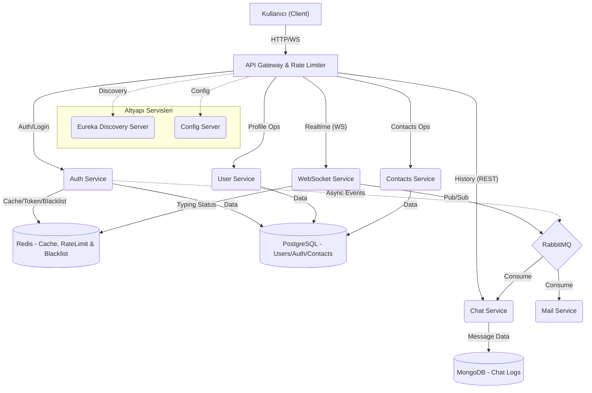
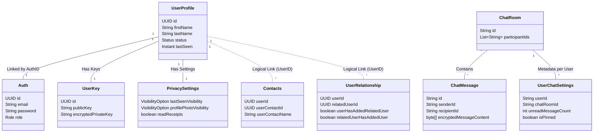
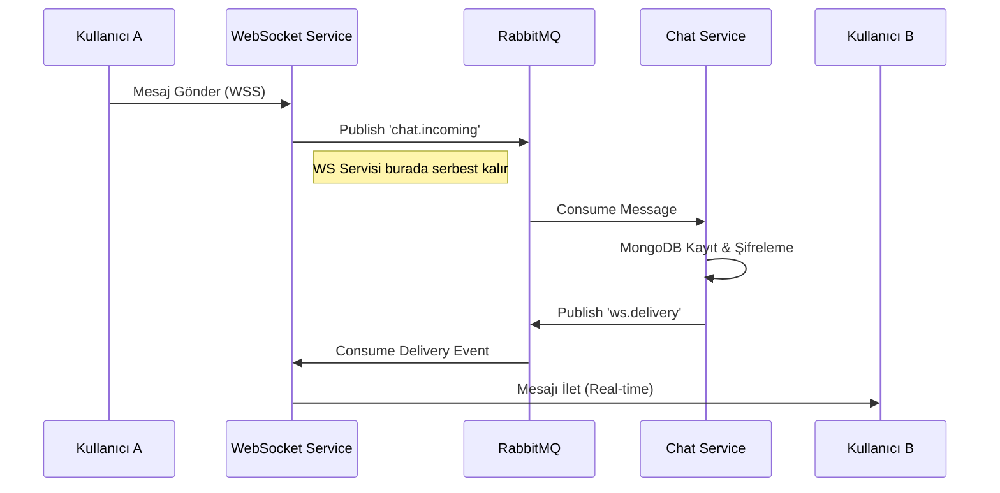
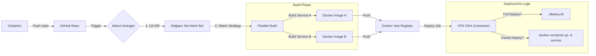

# Güvenli Chat Uygulaması: Backend Mimari ve Detayları

    Bu dokümanda, yüksek performanslı ve tam güvenli (Uçtan Uca Şifreli - E2EE) bir gerçek zamanlı mesajlaşma (Chat) uygulamasının backend tarafında kullanılan mikroservis mimarisi, güvenlik önlemleri, veritabanı yapısı ve DevOps süreçleri detaylandırılmıştır.

    **Proje Hakkında:** Bu uygulama basit bir mesajlaşma arayüzünün ötesine geçerek; RabbitMQ ve WebSockets aracılığıyla anlık ve kesintisiz iletişim altyapısı kuran, Spring Cloud (Eureka & API Gateway) desteğiyle mikroservis mimarisini yansıtan, MongoDB ile PostgreSQL'in hibrit (Polyglot Persistence) olarak kullanıldığı ve Zero-Knowledge (Sıfır Bilgi) prensibiyle sunucunun bile mesajları okuyamayacağı bir kriptografik düzene sahip gelişmiş bir sohbet sistemidir. Amacı, ölçeklenebilir ve tam anlamıyla "özel" bir iletişim kanalı inşa etmektir.

    
        
    ---

    ## 1. Genel Sistem Mimarisi ve Akış

    Proje, karmaşıklığı yönetmek ve ölçeklenebilirliği artırmak amacıyla **Mikroservis Mimarisi** ile tasarlanmıştır.

    ### 1.1 Mimari Bileşenler

    - **API Gateway (Spring Cloud Gateway)**: Sistemin dışa açılan kapısıdır. **Redis + Lua Script** tabanlı "Token Bucket" algoritması ile Rate Limiting (Hız Sınırlama) uygular. Ayrıca JWT doğrulama ve yük dengeleme (Load Balancing) işlemlerini üstlenir.
- **Service Discovery (Eureka)**: Mikroservislerin dinamik adres defteridir. Servislerin birbirini IP/Port bilmeden bulmasını sağlar (Client-Side Discovery).
- **Config Server**: Tüm mikroservislerin konfigürasyonlarını (Veritabanı, Port, Secret Key vb.) merkezi bir noktadan yönetir ve çalışma zamanında güncellemeyi sağlar.
- **Authentication Service**: Kimlik yönetim merkezidir. **Google reCAPTCHA v3** ile bot koruması sağlar ve çıkış yapan kullanıcıların tokenlarını **Redis Blacklist** üzerinde SHA-256 hash'leri ile bloklar.
- **WebSocket Service**: Gerçek zamanlı iletişimin merkezidir. **Redis Streams** kullanarak mesaj kaybını önler. Ayrıca kullanıcıların "Çevrimiçi/Çevrimdışı" durumlarını **Redis Key Expiration** eventlerini dinleyerek yönetir ve gizlilik kurallarına göre anlık broadcast eder.
- **Chat Service**: Mesajlaşma işlemlerini yönetir. Mesajları yüksek performans için **MongoDB** üzerinde saklar ve uçtan uca şifreli (E2EE) veri bütünlüğünü korur.
- **User Service**: Profil ve gizlilik ayarlarını yönetir. "Last Seen" gibi verileri, kullanıcının gizlilik ayarlarına göre (Örn: Sadece Arkadaşlar) filtreleyerek sunar.
- **Contacts Service**: Kişi listesi ve engelleme (Block) işlemlerini yönetir. İlişkisel veri tabanı (PostgreSQL) üzerinde kullanıcılar arası bağları tutar.
- **Notification/Mail Service**: Asenkron bildirim servisidir. **RabbitMQ** üzerinden gelen olayları (Event) dinler ve sistemi bloklamadan e-posta gönderir.

    ### 1.2 Sistem Akış Diyagramı

    


    ---

    ## 2. Veritabanı Mimarisi ve Kod Yapısı

    Veri tutarlılığı ve performans için İlişkisel (PostgreSQL) ve Doküman tabanlı (MongoDB) veritabanları birlikte kullanılmıştır (Polyglot Persistence).

    
    ### 2.1 Varlık Diyagramı (ER Diagram)

    


    ---

    ## 3. İletişim Protokolleri: WebSocket ve REST Birlikte Kullanıldı?

    Modern uygulamalarda "Her şey WebSocket olsun" veya "Her şey REST olsun" yaklaşımı yerine **Hibrit İletişim** modeli benimsenmiştir.

    ### 3.1 RESTful API (HTTP)

    - **Kullanım Alanı**: Kullanıcı kaydı, girişi yapma, profil güncelleme, geçmiş mesajları listeleme.
- **Neden?**: Stateless (durumsuz) yapısı sayesinde sunucu kaynaklarını tüketmez. Cache mekanizmaları (CDN, Browser Cache) ile uyum halindedir. İste ve Cevap Al (Request-Response) mantığına uygun işlemler için idealdir.
- **Swagger/OpenAPI**: Tüm REST endpointleri Swagger ile dokümante edilmiştir.

    ### 3.2 WebSocket (STOMP)

    - **Kullanım Alanı**: Anlık mesajlaşma, "Yazıyor..." bilgisi, Çevrimiçi/Çevrimdışı durum güncellemeleri.
- **Neden?**: REST her yeni veri için yeni bir HTTP bağlantısı açar (Header overhead). WebSocket ise tek bir TCP bağlantısı üzerinde sürekli açık bir kanal sağlar (Full-Duplex). Bu sayede milisaniyeler mertebesinde gerçek zamanlı iletişim kurulur.

    
```javascript
// Frontend: Robust WebSocket Manager (websocket.js)
export default class WebSocketManager {
  constructor(url) {
    this.client = new Client({
      brokerURL: this.url,
      reconnectDelay: 3000, // Auto-reconnect every 3s
      
      beforeConnect: () => {
        // Inject secure JWT token
        this.client.connectHeaders = {
            Authorization: `Bearer ${sessionStorage.getItem("access_token")}`,
        };
      },

      onWebSocketClose: async (evt) => {
        // Handle unexpected closures with backoff logic
        console.warn("WebSocket closed, retrying...");
        await this.tryRefreshAndReconnect();
      }
    });

    // Smart Optimization: Reduce ping frequency when tab is hidden
    document.addEventListener("visibilitychange", () => {
        !document.hidden ? this.startPing() : this.stopPing();
    });
  }
}
```

    ---

    ## 4. Gerçek Zamanlı İletişim & RabbitMQ: Gerçek Zamanlı İletişim Mimarisi

    Sohbet uygulamasının kalbi, **WebSocket** ve **RabbitMQ** ikilisiyle atar. Bu yapı, **Event-Driven (Olay Güdümlü)** bir mimari sağlar.

    ### 4.1 Neden RabbitMQ?

    Klasik WebSocket uygulamalarında sunucu yeniden başlatıldığında veya çok fazla kullanıcı geldiğinde sistem tıkanır. RabbitMQ burada **Arabellek (Buffer)** görevi görür:

    - **Producer (Üretici)**: Kullanıcı A mesaj attığında, WebSocket Servisi bu mesajı doğrudan Kullanıcı B'ye **iletmez**. Mesajı RabbitMQ'daki `chat.incoming` kuyruğuna bırakır ve işini bitirir (Asenkron).
- **Consumer (Tüketici)**: Chat Servisi, kuyruktan mesajı müsait olduğunda alır, veritabanına kaydeder ve "Mesaj Kaydedildi" olayını/event'ini tekrar RabbitMQ'ya (bu sefer `ws.delivery` kuyruğuna) bırakır.
- **Delivery (Teslimat)**: WebSocket Servisi, `ws.delivery` kuyruğundan gelen "Hazır" mesajını alır ve o an bağlı olan Kullanıcı B'ye iletir.

    


    ### 4.2 Online/Offline Status Yönetimi

    Kullanıcının çevrimiçi durumu veritabanına sürekli yazılmaz (Performans kaybı). Bunun yerine **Redis + WebSocket Events** kullanılır.

    - **Connect**: Kullanıcı WebSocket'e bağlandığında, Redis'te `online_users` setine eklenir ve "Ben Geldim" eventi yayılır.
- **Heartbeat**: İstemci her 15 saniyede bir "Ping" atarak Redis'teki süresini uzatır (TTL).
- **Disconnect**: Bağlantı koptuğunda veya Ping gelmediğinde, Redis'teki kayıt silinir ve arkadaşlarına "Çevrimdışı oldu" bilgisi gider.

    ### 4.3 WebSocket Senkronizasyonu: "Append-Only Log" Mimarisi

    Mobil ağlarda bağlantı kopmaları kaçınılmazdır. Bu proje, mesaj kaybını sıfıra indirmek için klasik "Kuyruk" (Queue) mantığı yerine, **Redis Stream** tabanlı kalıcı bir "Seyir Defteri" (Log) yapısı kullanır.

    ### 4.4 Mesajlar Silinmez, İşaretlenir (The Pointer / ACK Pattern)

    Bir mesaj iletildiğinde sunucudan **silinmez**. Sistem şu iki anahtar üzerinden çalışır:

    - **`ws:inbox:{userId}` (Veri)**: Kullanıcıya gelen tüm mesajlar buraya "Append" (ekleme) yapılır. Burası 5000 mesaj kapasiteli, 3 gün ömürlü (TTL) bir zaman tünelidir.
- **`ws:ack:{userId}` (İşaretçi)**: Kullanıcının *"Ben en son burayı okudum"* dediği yer imidir (Last Read Offset).

    ### 4.5 Neden Bu Yöntem? (Crash Recovery)

    Eğer klasik kuyruk kullansaydık ve mesajı yolladığımız an silseydik; kullanıcı mesajı alıp işleyemeden (şarjı bitip) kapansaydı, o mesaj **ebediyen kaybolurdu**. Bu yapıda ise mesaj stream'de durur. Kullanıcı geri geldiğinde kaldığı yerden devam eder.

    ### 4.6 İstemci ve Sunucu İletişim Akışı (Client-Server Handshake)

    - **Bağlantı Anı (Sync)**: Tarayıcı açılır açılmaz `sync` komutu yollar.
- **Sunucu Hesabı**: Backend, kullanıcının `ws:ack` (kaldığı yer) işaretine bakar. (Örn: 1005)
- **Geçmiş Verilerin Senkronizasyonu (State Synchronization)**: `ws:inbox` içinde 1005'ten sonra gelen ne varsa (1006, 1007...) paketleyip yollar.
- **ACK (Onay)**: İstemci mesajı başarıyla işleyince `ACK { id: 1006 }` döner ve işaretçi ileri taşınır.

    
    
```java
// WebSocketService.java - The Sync Logic
public void syncToUser(String userId) {
    // 1. Kullanıcının kaldığı yeri bul (Last Checkpoint)
    String lastAck = redisTemplate.opsForValue().get("ws:ack:" + userId);
    if (lastAck == null) lastAck = "0-0"; // Hiç okumamışsa baştan başla

    // 2. O noktadan sonraki mesajları Stream'den oku
    List records = ops.read(StreamOffset.create("ws:inbox:" + userId, ReadOffset.from(lastAck)));
    
    // 3. Kullanıcıya ilet
    for (var rec : records) {
        messagingTemplate.convertAndSendToUser(userId, dest, payload);
    }
}
```

    ---

## 5. Güvenlik Mimarisi

     ### 5.1 E2EE (Uçtan Uca Şifreleme) Akışı

    Mesajlaşma güvenliği **Hibrit Şifreleme** (RSA + AES) ile sağlanır.

    #### Kriptografik Algoritmalar: RSA ve AES Nedir?

    - **AES (Simetrik Şifreleme):** Tek bir "gizli anahtarın" hem şifreleme hem de şifre çözme için kullanıldığı, son derece hızlı ve büyük boyutlu verileri (uzun mesajları, dosyaları) şifrelemek için ideal olan algoritmadır. Ancak bu anahtarın karşı tarafa güvenli bir şekilde nasıl iletileceği "Anahtar Dağıtımı" (Key Distribution) sorunudur.
- **RSA (Asimetrik Şifreleme):** Her kullanıcının birbirine matematiksel olarak bağlı iki anahtarı vardır: *Public Key* (Herkese açık, kilit) ve *Private Key* (Sadece sahibinde olan, anahtar). Public Key ile şifrelenen bir veri, YALNIZCA o kişinin kimsenin bilmediği Private Key'i ile çözülebilir. Ancak çok yavaş ve ağır bir işlemdir, büyük veriler (uzun sohbet metinleri) şifrelemek için yetersizdir. Orijinal uzun metni değil, sadece kısa ve ufak boyutlu verileri (örneğin kısa bir 256-bit AES şifresini/anahtarını) kilitlemek için uygundur.

    #### Neden Hibrit (İkisi Birlikte) Kullanılıyor?

    Performans ve güvenliğin mükemmel uyumu için her iki algoritmanın en güçlü özelliklerinden yararlanılır: **Ağır iş olan "mesajı şifreleme" işlemini hızlıca AES yapar; oluşturulan bu geçici AES anahtarını "kurye" gibi karşı tarafa güvenle taşıma işini ise RSA yapar.**

    
```mermaid
sequenceDiagram
        participant Ayse as "Ayşe (Gönderen)"
        participant Server as "Sunucu (Backend)"
        participant Burak as "Burak (Alıcı)"
        
        Note over Ayse: 1. Rastgele AES Anahtarı Üret
2. Mesajı AES ile Şifrele
        Note over Ayse: 3. AES Anahtarını
Burak'ın Public Key'i ile Şifrele
        Note over Ayse: 4. AES Anahtarını
Kendi Public Key'i ile Şifrele (Yedek)
        
        Ayse->>Server: Şifreli Mesaj + Key(Burak) + Key(Ayşe)
        Server->>Burak: Şifreli Mesaj + Key(Burak)
        
        Note over Burak: 1. Key(Burak)'ı<br/>Kendi Private Key'i ile Çöz (AES'i al)
        Note over Burak: 2. Mesajı AES Anahtarı<br/>ile Çöz
```

    
```javascript
// Frontend: E2EE Encryption Logic (e2ee.js)
export async function encryptMessage(message, recipientPublicKey, senderPublicKey) {
  // 1. Generate ephemeral AES Key for this message
  const aesKey = await window.crypto.subtle.generateKey(
    { name: "AES-GCM", length: 256 }, true, ["encrypt", "decrypt"]
  );

  // 2. Encrypt the actual message content with AES
  const iv = window.crypto.getRandomValues(new Uint8Array(12));
  const encryptedContent = await window.crypto.subtle.encrypt(
    { name: "AES-GCM", iv }, aesKey, new TextEncoder().encode(message)
  );

  // 3. Encrypt the AES Key with Recipient's RSA Public Key
  const encryptedKeyForRecipient = await window.crypto.subtle.encrypt(
    { name: "RSA-OAEP" }, recipientPublicKey, exportedAesKey
  );

  return {
    encryptedMessage: base64Encode(encryptedContent),
    encryptedKeyForRecipient: base64Encode(encryptedKeyForRecipient),
    iv: base64Encode(iv)
  };
}
```

    **Not**: Ayşe'nin AES anahtarını kendi Public Key'i ile de şifrelemesinin sebebi, mesajı daha sonra kendi geçmişinde ("Kendisi için şifrelenmiş" kopyasını çözerek) okuyabilmesidir. Sunucu sadece şifreli veri (blob) taşır, içeriği asla göremez.

    ---
### 5.2 Kimlik Doğrulama Yaşam Döngüsü: Register, Login ve Parola Sıfırlama (Hard Reset)

    Bu proje, klasik "Kullanıcı adı/Şifre" doğrulamasının ötesinde, kriptografik anahtarların yönetimini de içeren **Zero-Knowledge (Sıfır Bilgi)** prensibine dayalı bir akış kullanır.

    ### 5.3 Kayıt (Register): İstemci Tarafında Anahtar Üretimi

    Kullanıcı kayıt olduğunda sadece veritabanına bir satır eklenmez; tarayıcıda (Client-Side) kimliğe ait şifreleme anahtarları (Key Pair) inşa edilir.

    - **Adım 1 (Key Gen)**: Tarayıcı `RSA-OAEP` algoritması ile bir Public/Private Key çifti üretir.
- **Adım 2 (Key Wrapping)**: Kullanıcının girdiği parola, `PBKDF2` ile güçlendirilerek bir AES anahtarına dönüştürülür.
- **Adım 3 (Encryption)**: Saf `Private Key`, bu AES anahtarı ile şifrelenir.
- **Adım 4 (Storage)**: Sunucuya `Public Key` (Açık) ve `Encrypted Private Key` (Şifreli) gönderilir. Sunucu, Private Key'i çözemez çünkü parolayı bilmez.

    ### 5.4 Giriş (Login): Anahtarların Belleğe Alınması (Key Retrieval)

    Giriş işlemi, sadece sisteme oturum açmak değil; aynı zamanda şifreli olan kriptografik hafızayı deşifre edip geri çağırmaktır.

    - **Backend Kontrolü**: Kullanıcı şifresi hash'lenerek doğrulanır. Doğruysa JWT Token ve `Encrypted Private Key` istemciye döner.
- **Client-Side Decryption**: Kullanıcı parolasını tekrar girmiştir. Tarayıcı bu paroladan yine AES anahtarını türetir ve sunucudan gelen şifreli Private Key'i çözer.
- **Sonuç**: Private Key belleğe (RAM) alınır ve mesajlar çözülebilir hale gelir.

    ### 5.5 Şifre Sıfırlama (Forgot Password) ve Geçmiş Veri Kaybı (Hard Reset)

    Eğer kullanıcı parolasını unutursa, Private Key'ini açacak anahtarı da kaybetmiş demektir. Sistem güvenliği gereği eski anahtarlar kurtarılamaz ve bu durumda **Sert Sıfırlama (Hard Reset)** devreye girer.

    
        **Kritik Uyarı:** Şifre sıfırlama işlemi, mevcut kimliği yok eder ve yerine yenisini koyar.
    
    - **Doğrulama**: E-posta ve OTP ile kullanıcının hesabı doğrulanır.
- **Yeni Anahtar Üretimi**: Tarayıcıda **YEPYENİ** bir Key Pair üretilir.
- **Eski Veriye Veda**: Eski Public Key ile şifrelenmiş tüm geçmiş mesajlar artık çöp (garbage) veridir; çünkü onları açacak eski Private Key, eski parola ile birlikte tarihe karışmıştır.
- **Yeni Başlangıç**: Kullanıcı yeni parolasıyla, yeni anahtarlarını şifreler ve sunucuya gönderir. Artık sadece bu andan sonra gelen mesajları okuyabilir.

    
    
```javascript
// ForgotPassword.js - The "Hard Reset" Logic
async resetPassword() {
    // 1. Generate NEW Key Pair (Old keys are gone!)
    const { publicKey, privateKey } = await generateKeyPair();

    // 2. Encrypt NEW Private Key with NEW Password
    const aesKey = await deriveAESKey(newPassword, salt);
    const encryptedPrivateKey = await encryptPrivateKey(privateKey, aesKey, iv);

    // 3. Send to Backend (Overwrites old keys)
    const resetRequest = new ResetPasswordRequestDTO(
        email, newPassword, resetToken, 
        publicKey, encryptedPrivateKey, ...
    );
    await authService.resetPassword(resetRequest);
}
```

### 5.6 Token Blacklist Deşifresi: Backend Tarafında Neden ve Nasıl?

    Backend güvenliğinde en çok tartışılan konulardan biri: *Stateless (Durumsuz) JWT mimarisi kullanırken, logout olan bir kullanıcının token'ını nasıl geçersiz kılarız?*

    ### 5.7 🔴 Problem: "Stateless" (Durumsuz) Mimarinin Zafiyeti (Drawback)

    JWT (JSON Web Token), doğası gereği kendi kendine yeten (self-contained) bir yapıdadır. Token bir kez imzalandıktan sonra, süresi dolana kadar (expire) geçerlidir. Sunucu bu tokenı tanıdığı sürece, kullanıcı "Çıkış Yap" (Logout) butonuna bassa bile, eğer o token bir şekilde kopyalanmışsa hala kullanılabilir.

    - **Klasik Session**: Sunucuda oturum silinir -> Erişim biter.
- **Standart JWT**: Sunucuda oturum yok -> Erişim **bitmez**.

    ### 5.8 Çözüm: Redis ile "Stateful" Kontrol (Hibrit Yaklaşım)

    Bu projede, JWT'nin performans avantajını korurken güvenliği sağlamak için **Redis tabanlı Blacklist (Kara Liste)** mekanizması geliştirilmiştir.

    #### Uygulama Akışı

    - **Logout İsteği**: Kullanıcı çıkış yaptığında, client üzerindeki token silinmeden hemen önce backend'e gönderilir.
- **TTL (Time-To-Live) Hesaplaması**:
            - `TokenBlacklistService`, gelen token'ın içinde yazan `exp` (expiration) zamanını okur.
- (Token Bitiş Zamanı) - (Şu An) = **Kalan Ömür (TTL)** hesaplanır.
- **Redis'e Mühürleme**:
            - Token'ın benzersiz imzası (hash) Redis'e kaydedilir.
- **Anahtar**: `blacklist:{token_hash}`
- **Süre**: Hesaplanan TTL kadar.
- **Güvenlik Duvarı (Filter)**:
            - Her gelen istek `AuthenticationFilter` veya `Gateway` üzerinden geçerken şu kontrol yapılır:
- *"Bu token Redis'teki kara listede var mı?"*
- **Evet ise**: `401 Unauthorized` (Tokenın süresi dolmamış olsa bile!)
- **Hayır ise**: İşleme devam et.

    
```java
@Component
public class AuthenticationFilter implements GatewayFilter {
    @Override
    public Mono<Void> filter(ServerWebExchange exchange, GatewayFilterChain chain) {
        String token = exchange.getRequest().getHeaders().getFirst(HttpHeaders.AUTHORIZATION);
        
        // 1. Check if token exists in Redis Blacklist
        if (tokenBlacklistService.isBlacklisted(token)) {
            return errorResponse(exchange, HttpStatus.UNAUTHORIZED);
        }

        // 2. Validate Token via Auth Service (or locally if signed)
        return webClientBuilder.build().get()
                .uri("lb://auth-service/validate?token=" + token)
                .retrieve().bodyToMono(Boolean.class)
                .flatMap(isValid -> {
                    if (isValid) return chain.filter(exchange);
                    else return errorResponse(exchange, HttpStatus.UNAUTHORIZED);
                });
    }
}
```

    Bu sayede, veritabanına her istekte gitmek yerine, milisaniyeler içinde cevap veren RAM tabanlı Redis kullanılarak performans kaybı yaşanmadan tam güvenlik sağlanır.

    ---
### 5.9 Güvenlik ve Rate Limiting: Neden Lua Script?

    API güvenliğinde en kritik konulardan biri **Rate Limiting** (Hız Sınırlama) mekanizmasıdır. Bu projede **Token Bucket** algoritması **Redis + Lua Script** ile birleştirilerek uygulanmıştır.

    ### 5.10 Neden Rate Limiting?

    Bir saldırgan saniyede 1000 kez giriş denemesi yaparak şifreleri kırmaya çalışabilir (Brute Force) veya servisi kilitleyebilir (DDoS). Bunu engellemek için IP veya User bazlı kısıtlamalar şarttır.

    ### 5.11 Neden Redis ve Lua Script?

    Dağıtık sistemlerde (Distributed Systems) **Race Condition** (Yarış Durumu) büyük bir problemdir.

    
    **Senaryo (Lua Olmadan):**

    - Kullanıcının 1 hakkı kaldı.
- **İstek A** gelir, Redis'ten okur: "Kalan Hak: 1". (Henüz düşmedi)
- Eş zamanlı **İstek B** gelir, Redis'ten okur: "Kalan Hak: 1".
- İkisi de hakkı kullanır ve limiti aşar.

    **Çözüm (Lua Script ile Atomik İşlem):**

    Lua scriptleri Redis sunucusu üzerinde **atomik** olarak çalışır. Yani script çalışırken araya başka hiçbir işlem giremez.

    - "Oku -> Kontrol Et -> Düşür" işlemleri tek bir adımda yapılır.
- Bu sayede %100 tutarlı bir sayaç ve yüksek performans sağlanır.

    
```lua
-- Redis Lua Script: Token Bucket Algorithm
local tokens = tonumber(redis.call("GET", tokensKey))
local lastTs = tonumber(redis.call("GET", tsKey))

if tokens == nil then tokens = capacity end
if lastTs == nil then lastTs = nowMs end

-- Refill tokens based on time passed
local delta = nowMs - lastTs
local rate = capacity / windowMs
tokens = math.min(capacity, tokens + (delta * rate))

-- Check if request is allowed
if tokens >= 1 then
  tokens = tokens - 1
  allowed = 1
else
  allowed = 0 -- 429 Too Many Requests
end

-- Save state
redis.call("SET", tokensKey, tokens)
redis.call("SET", tsKey, nowMs)
return {allowed, tokens}
```

### 5.12 Sunucu Taraflı Gizlilik (Server-Side Privacy)

    Gizlilik ayarları sadece arayüzde (Frontend) değil, **Veritabanı ve API seviyesinde (Backend)** zorlanır. Buna "Double Layer Privacy" denir.

    
    ### 5.13 Senaryo: "Last Seen" (Son Görülme) Gizliliği

    Ahmet, son görülmesini "Kimse Görmesin" (NOBODY) olarak ayarladı.

    - **Frontend Koruması**: Arayüzde Ahmet'in son görülme bilgisi gizlenir. Ama art niyetli bir kullanıcı API'ye doğrudan istek atabilir.
- **Backend Koruması (Enforcer)**: `UserProfileService`, veriyi veritabanından çekerken `PrivacySettings` tablosuna bakar.
            - Eğer ayar `NOBODY` ise, `lastSeen` alanını **null** yaparak gönderir.
- Eğer ayar `MY_CONTACTS` ise, Redis'ten "Arkadaş mı?" kontrolü yapar. Arkadaş değilse yine **null** döner.

    
```java
// UserProfileService.java - Privacy Enforcement Logic
private UserProfileResponseDTO applyPrivacyFiltering(UserProfileResponseDTO target, String requesterId) {
    // Kendi profilini sorguluyorsa sansürleme
    if (target.id().toString().equals(requesterId)) return target;

    UserProfileResponseDTO.UserProfileResponseDTOBuilder builder = target.toBuilder();
    
    // Last Seen Kontrolü
    if (!isActionAllowed(target.id().toString(), requesterId, target.privacySettings().lastSeenVisibility())) {
        builder.lastSeen(null); // Veriyi KAYNAĞINDAN sil
    }
    
    // Profil Fotoğrafı Kontrolü
    if (!isActionAllowed(target.id().toString(), requesterId, target.privacySettings().profilePhotoVisibility())) {
        builder.image(null); // Fotoğraf URL'ini gizle
    }

    return builder.build();
}
```

    
    ### 5.14 🔄 Dinamik Güncelleme ve Anlık Koruma (Active Enforcement)

    Gizlilik sadece veri çekilirken değil, **ayarlar değiştiği anda** da devreye girer. Kullanıcı gizlilik ayarını değiştirdiğinde:

    - **Event Tetiklenir**: `updatePrivacySettings` metodu çalışır ve RabbitMQ üzerinden `privacy.updated` eventi fırlatılır.
- **Anlık Bildirim**: Bu event, ilgili kullanıcının profiline bakan tüm diğer kullanıcılara (WebSocket üzerinden) ulaşır.
- **Canlı Sansür**: Karşı tarafın ekranındaki veri (örneğin Last Seen bilgisi) anında silinir veya güncellenir. Sayfa yenilemeye gerek yoktur.

    
```java
// UserProfileService.java - Real-time Update Propagation
@Transactional
public UpdateSettingsDTO updatePrivacySettings(PrivacySettingsDTO dto, String userId) {
    // 1. Save new settings to DB
    userProfile.setPrivacySettings(newSettings);
    repository.save(userProfile);

    // 2. Notify everyone monitoring this user
    rabbitMQProducer.privacyUpdated(dto); 
    
    return dto;
}
```

    
    ### 5.15 🎯 Hedefli Yaptırım (Targeted Enforcement)

    Sunucu, "Ben gizliliğimi değiştirdim" mesajını herkese körü körüne yayınlamaz. **PrivacyUpdatedListener** sınıfı, bu değişikliği alıp şu akıllı süzgeçten geçirir:

    - Kullanıcının tüm rehberini (Contacts) çeker.
- Her bir arkadaşı için tek tek `canSeeProfilePhoto(viewerId, userId)` kontrolü yapar.
- Eğer erişim hakkı kaybolmuşsa (örneğin "Herkes"ten "Hiçkimse"ye geçildiyse), o arkadaşa özel olarak **"Resim: null"** verisini yollar.
- Böylece istemci (Client) tarafında veri fiziksel olarak silinir.

    
    
        **Sunucu Tabanlı Filtreleme (Server-Side Filtering):**
        

        Kullanıcı çevrimiçi olduğunda veya son görülme saati oluştuğunda, sunucu bu bilgiyi herkese aynı şekilde göndermez.
        

        `StatusBroadcastService.java` içerisinde:
        - Sunucu, alıcı listesindeki (Contacts) herkesi **tek tek** döngüye alır.
- Her alıcı için `visibilityPolicy.canSeeOnline(viewer, target)` fonksiyonunu çalıştırır.
- Eğer alıcının görme yetkisi yoksa, ona özel olarak **"status: hidden"** verisi üretilir ve gönderilir.
- Yetkisi olanlar ise gerçek **"status: online"** bilgisini alır.

        Bu sayede, istemci (Frontend) tarafında herhangi bir güvenlik açığı olsa bile, yetkisiz kullanıcılar asla gerçek veriye ulaşamaz.
    ### 5.16 Google reCAPTCHA v3: Botlara Karşı Görünmez Kalkan

    Kullanıcı deneyimini bozmadan (resim seçtirmeden) arka planda çalışan **reCAPTCHA v3** entegrasyonu ile bot saldırıları engellenir.

    
    ### 5.17 Nasıl Çalışır?

    - **Frontend (Puanlama)**: Kullanıcı "Giriş Yap" butonuna bastığında, tarayıcı arka planda Google'dan bir token alır. Google, kullanıcının fare hareketlerine ve geçmişine göre 0.0 ile 1.0 arasında bir puan (score) verir.
- **Backend (Doğrulama)**: Frontend bu token'ı Login/Register isteği ile birlikte sunucuya gönderir.
- **Karar Mekanizması**: Sunucu (Auth Service), Google API'sine sorar: "Bu token geçerli mi ve puanı kaç?". Eğer puan 0.5'in altındaysa istek reddedilir.

    
```java
// AuthService.java - ReCaptcha Verification Logic
private void captcha(String recaptchaToken, String action) {
    ReCaptchaResponseDTO captchaResponse = reCaptchaService.verify(recaptchaToken);

    // 1. Token Geçerli mi?
    if (captchaResponse == null || !captchaResponse.success()) {
        throw new AuthManagerException(ErrorType.RECAPTCHA_FAILED);
    }
    // 2. Aksiyon Eşleşiyor mu? (Örn: "login" vs "signup")
    if (!action.equals(captchaResponse.action())) {
        throw new AuthManagerException(ErrorType.RECAPTCHA_FAILED);
    }
    // 3. Puan Yeterli mi? (0.5 altı bot kabul edilir)
    if (captchaResponse.score() < 0.5) {
        throw new AuthManagerException(ErrorType.RECAPTCHA_FAILED);
    }
}
```

    
        **Önemli:** Bu işlem her **Login**, **Register** ve **Şifre Sıfırlama** isteğinde zorunludur. Token olmadan API'ye atılan istekler doğrudan reddedilir.
    
    ---

    ## 6. Interceptor & Filter Mimarisi: Trafik Kontrolü

    Uygulamanın hem önüne hem de arkasına "Gümrük Kapıları" (Interceptors/Filters) yerleştirilerek, her istek ve cevap otomatik kontrolden geçirilir.

    ### 6.1 Frontend (Axios Interceptors)

    React tarafında her API isteğini manuel olarak yönetmek yerine, merkezi bir `axiosConfig.js` yapısı kurulmuştur.

    - **Request Interceptor**: `sessionStorage`'dan **Access Token**'ı alıp, otomatik olarak `Authorization: Bearer xyz` başlığını ekler.
- **Response Interceptor**:
            - **Otomatik Token Yenileme (401 Retry)**: Arka planda sessizce **Refresh Token** ile yeni bir Access Token alır ve orijinal isteği tekrarlar.
- **Global Hata Yönetimi**: Toast mesajları ile kullanıcı bilgilendirilir.

    ### 6.2 Backend (API Gateway Filters)

    Spring Cloud Gateway, tüm trafiği karşılayan bir "Güvenlik Duvarı" gibi çalışır.

    - **Authentication Filter**: JWT doğrulama, Blacklist kontrolü ve `X-Id` forward etme işlemleri.
- **Rate Limiter Filter**: Redis + Lua ile hız sınırını aşan kullanıcıları engeller (`429 Too Many Requests`).

    ---

    ## 7. Gelişmiş Mühendislik Detayları (Under the Hood)

    Projede kullanılan ancak arayüzde görünmeyen, sistemin sağlıklı ve sürdürülebilir olmasını sağlayan teknolojiler.

    ### 7.1 Merkezi Hata Yönetimi (Global Exception Handling)

    Try-catch bloklarıyla kodu kirletmek yerine, tüm hatalar tek bir merkezden (`@ControllerAdvice`) yakalanır ve standart bir formatta istemciye dönülür.

    
```java
@RestControllerAdvice
public class GlobalExceptionHandler {
    @ExceptionHandler(AuthManagerException.class)
    public ResponseEntity<ErrorResponse> handleAuthException(AuthManagerException ex) {
        // Tüm Auth hataları buradan standart formatta döner
        return createResponse(ex.getErrorType());
    }
}
```

    ### 7.2 Observability & Monitoring (Gözlemlenebilirlik)

    - **Spring Boot Actuator**: Mikroservislerin sağlık durumunu (Health Check), metriklerini ve konfigürasyonlarını dışarıya açar.
- **Micrometer & Prometheus**: Sistem metriklerini (CPU, RAM, Request Sayısı) toplar.
- **Spring Cloud Sleuth**: Dağıtık izleme (Distributed Tracing) sağlar. Bir istek Gateway'den girip Auth -> User -> Mongo servislerini gezerken, hepsine aynı `TraceID` etiketini basar. Böylece loglarda bir isteğin tüm yolculuğu izlenebilir.

    ### 7.3 Resilience4j (Circuit Breaker)

    Bir mikroservis çöktüğünde (Örn: User Service yanıt vermiyor), hatanın tüm sistemi kilitlemesini (Cascading Failure) önler. Belirli bir hata oranını geçerse şalteri indirir ve "Hizmet verilemiyor" diyerek hızlı yanıt döner.

    ### 7.4 MapStruct (DTO Mapping)

    Entity <-> DTO dönüşümleri için manuel kod yazmak yerine, derleme zamanında (Compile Time) çalışan ve çok yüksek performanslı olan **MapStruct** kütüphanesi kullanılmıştır. Reflection kullanmadığı için çok hızlıdır.

    ### 7.5 i18n (Uluslararasılaştırma)

    Frontend (`i18n.js`) ve Backend, çoklu dil desteğine uygun tasarlanmıştır. Hata mesajları ve arayüz metinleri dil dosyalarından dinamik olarak okunur.

    ---

    ## 8. Altyapı ve DevOps: Kesintisiz Dağıtım

    Projenin sadece kodlanması değil, canlıya alınması (Deployment) süreçleri de modern standartlara göre tasarlanmıştır.

    ### 8.1 Sunucu ve Konteynerizasyon

    - **VPS (Virtual Private Server)**: Uygulama, Linux tabanlı bir bulut sunucu üzerinde koşmaktadır.
- **Docker & Docker Compose**: Tüm mikroservisler ve veritabanları (Postgres, Mongo, Redis, RabbitMQ) Docker konteynerleri içine hapsedilmiştir.
- **SSL & HTTPS/WSS**: Tüm trafik şifrelidir. WebSocket için `wss://` kullanılır.

    ### 8.2 CI/CD Pipeline (GitHub Actions - vkychatapp)

    Projenin CI/CD süreci, kaynakların verimli kullanımı için **Akıllı Değişiklik Algılama (Smart Change Detection)** üzerine kurulmuştur. Her push işleminde tüm sistemin yeniden derlenmesi yerine, sadece etkilenen mikroservisler tespit edilir.

    
    


    #### 🚀 Backend Pipeline (Spring Boot)

    - **Adım 1: İz Sürme (Detect Changes):** `git diff` komutu ile son commitlerde hangi klasörlerin (örn: `chat-service/`, `auth-service/`) değiştiği analiz edilir.
- **Adım 2: Karar Mekanizması:**
            <ul>
                <li>Eğer sadece `user-service` değiştiyse, pipeline sadece bu servisi derler.
- Eğer `config-server` veya `build.gradle` gibi çekirdek dosyalar değiştiyse, **"Full Deploy"** modu tetiklenir ve tüm sistem yenilenir.

        </li>
        <li>**Adım 3: SSH & Deployment:** GitHub Actions, üretim sunucusuna (VPS) bağlanır.
            - **Partial Deploy:** Sadece güncellenen konteyner durdurulur, yeni imaj çekilir ve `docker-compose up -d --no-deps service_name` ile ayağa kaldırılır. Kesinti süresi minimumdur.
- **Full Deploy:** Tüm sistem `docker-compose` ile yeniden başlatılır.

        </li>
    </ul>

    #### ⚛️ Frontend Pipeline (React/Vite)

    Ayrı bir repository (`vkychatapp-frontend`) üzerinden yönetilir.

    - Build aşamasında `VITE_BASE_URL` gibi ortam değişkenleri (Environment Variables) Docker imajına gömülür (Build Arguments).
- Sunucuda çalışırken `nginx` veya `serve` yerine, optimize edilmiş Docker konteyneri (`vkychatapp-frontend`) doğrudan 80/443 portlarını dinler veya bir Reverse Proxy (Caddy/Nginx) arkasında çalışır.

    
    ---

    <h2 id="local-setup">9. Lokalde Backend'i Çalıştırma Rehberi</h2>
    Projeyi kendi bilgisayarınızda (local environment) geliştirmek veya çalıştırmak için aşağıdaki adımları izleyebilirsiniz. Sistem mikroservis mimarisine sahip olduğu için bileşenlerin belirli bir sırayla ayağa kalkması önemlidir.

    
    ### 9.1 Repoyu Klonlama ve Gereksinimler

    Öncelikle backend reposunu bilgisayarınıza indirin:

    
```bash
git clone https://github.com/veyselkyazici/chat-app-b.git
cd chat-app-b
```

    **Gereksinimler:** Sisteminizde uygulamayı çalıştırabilmek için **Java 25**, **Docker** ve **Docker Compose** kurulu olmalıdır.

    ### 9.2 Mikroservis Konfigürasyonlarını (dev.yml) Ayarlama

    Uygulamayı lokalde tam olarak çalıştırabilmek için, `config-server/src/main/resources/configyml/` dizini altındaki mikroservislere ait `-dev.yml` yapılandırma dosyalarını kendi sisteminize göre doğrudan düzenlemeniz gerekmektedir.

    
    #### User Service (user-service-dev.yml) - Profil Fotoğrafı (Cloudinary) Ayarları

    Kullanıcıların profil fotoğraflarını yükleyebilmesi için **Cloudinary** servis ayarlarını dosya içerisindeki ilgili alanlara sabit değer olarak girmelisiniz:

    
```yaml
cloudinary:
  cloud:
    name: kendi_cloud_adiniz
  api:
    key: kendi_api_key_degeriniz
    secret: kendi_api_secret_degeriniz
```

    #### Mail Service (mail-service-dev.yml) - SMTP (Mail) Ayarları

    E-posta doğrulama ve şifre sıfırlama işlemlerinin çalışabilmesi için SMTP (E-posta) ayarlarını direkt olarak bu dosyaya yazmalısınız (Örn: Gmail SMTP):

    
```yaml
spring:
  mail:
    host: smtp.gmail.com
    port: 587
    username: kendi_mail_adresiniz@gmail.com
    password: kendi_uygulama_sifreniz
    verify:
      host: http://localhost:3000
```

    **Diğer Servisler:** Sistemdeki diğer tüm servisler (Auth, Chat, WebSocket vs.) için veritabanı kullanıcı adı/şifreleri, RabbitMQ bağlantı bilgileri ve Redis configlerini ilgili servislerin `*-dev.yml` dosyalarındaki örneğin `${RABBITMQ_USER:veysel}` gibi tanımlanmış kısımların varsayılan değerlerini değiştirerek kendi ortamınıza göre çalıştırmanız en sağlıklısıdır.

    ### 9.3 Altyapı Servislerini Başlatma (Bağımlılıklar)

    Spring Boot mikroservislerini başlatmadan önce, sistemin bel kemiğini oluşturan veritabanı ve yardımcı sistemleri mutlaka ayağa kaldırmalısınız. Aksi takdirde backend servisleriniz hata verip kapanacaktır.

    
    Proje dizininde yer alan `docker-compose-dev.yml` dosyası bu ihtiyacı karşılar. Bu yapılandırma **PostgreSQL, MongoDB, Redis, RabbitMQ** ve veritabanı yönetimi için **pgAdmin** içerir.

    

    Tüm altyapıyı tek bir komutla başlatmak için terminalden proje ana dizininde şu komutu çalıştırın:

    
```bash
docker-compose -f docker-compose-dev.yml up -d
```

    *Not: Servislerin inmesi (image pull) zaman alabilir. Tüm servislerin başarıyla `Running` (Çalışıyor) durumuna geçtiğinden emin olduktan sonra bir sonraki adıma geçin.*

    ### 9.4 Mikroservisleri Çalıştırma

    Altyapı hazır olduktan sonra, mikroservisleri aşağıdaki sırayla başlatın. Servisleri IDE'niz üzerinden (Run as Spring Boot App) veya terminal aracılığıyla her klasöre girip `./gradlew bootRun` komutu ile çalıştırabilirsiniz:

    - **Config Server (Port 8888):** Güvenlik ve yapılandırma profillerini merkezden dağıtır. Diğer servislerin doğru ayarları okuyabilmesi için önce bu servisin tamamen ayağa kalkmasını bekleyin.
- **Eureka Server (Port 8761):** Servislerin birbirini port bağımsız bulmasını sağlayan discovery sunucusudur.
- **API Gateway (Port 8080):** Sistemdeki tüm isteklerin giriş yapmasını sağlayan ağ geçididir.
- **Diğer Servisler:** Auth Service, User Service, Contacts Service, Chat Service, WebSocket Service ve Mail Service sırası fark etmeksizin başlatılabilir.

    
        **Sıralama Uyarısı:** Sistem stabilitesi için servisleri başlatırken mutlaka şu sırayı izleyin: 

        `Config Server` → `Eureka Server` → `API Gateway` → `Diğer Servisler (Auth, Chat vb.)`
