# vkychatapp: Frontend Mimari ve Geliştirme Detayları

Bu dokümanda, güvenli ve gerçek zamanlı sohbet uygulamasının kullanıcı dostu ön yüzünde (Frontend) kullanılan **Vanilla JavaScript (Ecosystem-less SPA)** mimarisi, Özel Router yapısı, Optimizasyon stratejileri, Güvenlik kalkanları ve arayüz detayları derinlemesine incelenmektedir.

**Teknoloji Özeti:** Projenin arayüz katmanı herhangi bir ağır kütüphane veya framework (React, Vue, Angular) kullanılmadan, %100 saf JavaScript ve CSS ile inşa edilmiştir. Build mekanizması olarak **Vite** kullanılarak ışık hızında bir geliştirme ve paketleme altyapısı tercih edilmiştir.

## 1. Frontend Mimarisi ve SPA Yapısı

Uygulama, modern web standartlarına uygun olarak **Single Page Application (SPA)** mimarisi üzerine inşa edilmiştir. Bu yapı, kullanıcı deneyimini akıcı hale getirirken kodun modüler ve yönetilebilir olmasını sağlar.

### 1.1. 📄 Single Page Application (SPA) Temeli

Geleneksel web sitelerinin aksine, bu uygulama sadece tek bir HTML dosyasını (`index.html`) yükler. Sayfa geçişleri, sunucuya yeni bir istek atmadan, JavaScript (`index.js`) aracılığıyla DOM manipülasyonu yapılarak gerçekleştirilir. Bu sayede:

- **Performans:** Sayfa yenilenmediği için CSS ve JS dosyaları tekrar tekrar yüklenmez.
- **Hız:** Sadece değişen içerik güncellenir, bu da çok daha hızlı bir geçiş sağlar.

### 1.2. 🗂️ Sayfa Yapısı (Pages)

Uygulamadaki her bir "ekran" (Giriş, Kayıt, Sohbet vb.), `pages/` dizini altında bir JavaScript sınıfı olarak tanımlanır. Tüm sayfalar, ortak yaşam döngüsü metodlarını (`getHtml`, `init`, `destroy`) standartlaştıran `AbstractView` sınıfından türetilir.

- **AbstractView.js:** Tüm sayfaların türediği soyut (abstract) temel sınıftır. Sayfa başlıklarını dinamik olarak değiştirme (Checking Browser Title) gibi ortak metodları barındırır.
- **Home.js:** Kullanıcının ilk karşılaştığı açılış sayfasıdır (Landing Page/Dashboard).
- **Login.js:** Giriş yapma ekranıdır. E-posta, parola ve reCAPTCHA doğrulamasını yönetir.
- **Register.js:** Yeni üyelik ve E2EE anahtar üretiminin (Key Generation) yapıldığı sayfadır.
- **Chat.js:** Uygulamanın kalbidir. WebSocket bağlantısını başlatır, `ChatBox` ve `MessageBox` bileşenlerini bir araya getirerek ana sohbet arayüzünü oluşturur.
- **ForgotPassword.js:** Kademeli (Step-by-step) şifre sıfırlama sürecini yöneten sayfadır (E-posta -> OTP -> Yeni Şifre).
- **Verify.js:** E-posta doğrulama linkine tıklandığında açılan, token doğrulamasını yapan sayfadır.
- **VerificationSuccess.js / VerificationFailed.js:** Doğrulama sonucuna göre kullanıcıya gösterilen başarı veya hata ekranlarıdır.

### 1.3. 🧩 Bileşen Yapısı (Components)

Sayfalar, tekrar kullanılabilir ve özelleşmiş UI parçalarından (Components) oluşur. `components/` dizininde yer alan bu modüller, tek bir sorumluluğa odaklanır:

- **ChatBox.js:** Sol taraftaki sohbet listesini oluşturur. Kullanıcının son konuşmalarını listeler ve yeni sohbet başlatma işlemlerini yönetir.
- **MessageBox.js:** Uygulamanın en karmaşık bileşenidir. Seçilen sohbetin mesaj geçmişini yükler, anlık mesajlaşmayı (WebSocket), dosya gönderimini ve "Yazıyor..." durumlarını yönetir. Sanal Kaydırma (Virtual Scroll) burada aktiftir.
- **Navbar.js:** Sayfalar arası gezinti (Routing) için kullanılan üst menü çubuğudur.
- **Contacts.js:** Kullanıcının tüm rehberini listeler. Kişi arama, filtreleme ve engelleme işlemleri burada yapılır.
- **ContactInformation.js:** Sohbet edilen kişinin detaylı profil bilgilerini ve o kişiyle paylaşılan medyaları gösteren sağ paneldir.
- **Settings.js:** Kullanıcı ayarlarının yönetildiği kapsamlı paneldir. Gizlilik (Last Seen, Read Receipt), güvenlik (Şifre Değiştirme) ve profil düzenleme sekmelerini içerir.
- **AddContact.js:** Yeni kişi ekleme modalını yönetir. E-posta ve kullanıcı adı validasyonlarını yapar.
- **UpdateUserProfile.js:** Profil fotoğrafı yükleme ve kırpma (Cropping) işlemlerini yöneten modal bileşenidir.
- **Footer.js:** Sayfa altındaki telif hakkı ve bağlantı bilgilerini içeren statik bileşendir.

Bu ayrım sayesinde, örneğin `MessageBox` bileşeni değiştikçe tüm sayfanın yeniden render edilmesine gerek kalmaz, sadece ilgili alan güncellenir.

### 1.4. 🚦 Yönlendirme (Client-Side Routing)

`index.js` dosyasındaki **Router** mekanizması, tarayıcının adres çubuğundaki (URL) değişiklikleri dinler ve uygun sayfayı ekrana getirir. Ayrıca güvenlik kontrollerini de (Guard Clauses) burada yapar:

- **Auth Guard:** Giriş yapmamış bir kullanıcı `/chat` rotasına gitmeye çalışırsa, Router bunu engeller ve `/login` sayfasına yönlendirir.
- **History API:** Tarayıcının "Geri" ve "İleri" butonları, SPA içerisinde sorunsuz çalışacak şekilde entegre edilmiştir.

## 2. Gelişmiş Frontend Özellikleri ve UX İyileştirmeleri

Uygulamanın ön yüzü, sadece görsel bir arayüz sunmakla kalmaz; aynı zamanda performans, güvenlik ve kullanıcı deneyimini (UX) en üst düzeye çıkarmak için gelişmiş teknikler kullanır.

### 2.1. Uluslararasılaştırma (i18n)

Uygulama, `i18n.js` modülü üzerinden yönetilen ve **localStorage** tabanlı çalışan dinamik bir dil desteğine sahiptir. Bu yapı sayesinde:

- Dil değişimi (TR/EN) sayfa yenilemesi gerektirmeden anlık olarak gerçekleşir (Hot Swap).
- Kullanıcının dil tercihi tarayıcı hafızasında saklanır ve sonraki girişlerde hatırlanır.
- Metinler merkezi bir JSON yapısından (`tr.js`, `en.js`) çekilir, bu da bakımı kolaylaştırır.

### 2.2. Merkezi Veri Yönetimi ve Güvenlik (Axios & Interceptors)

Tüm HTTP istekleri, özelleştirilmiş bir `axiosConfig.js` üzerinden yönetilir. Bu katman şunları sağlar:

- **Otomatik Token Enjeksiyonu:** Her isteğe `Access Token` otomatik olarak eklenir.
- **Sessiz Token Yenileme (Silent Refresh):** 401 hatası alındığında, kullanıcıya hissettirmeden arka planda `Refresh Token` ile yeni bir oturum anahtarı alınır ve başarısız olan istek otomatik olarak tekrarlanır.
- **Merkezi Hata Yönetimi:** Backend'den dönen hata kodları (örn. 1004, 4003) burada yakalanır ve kullanıcıya anlamlı uyarılar (Toast Message) gösterilir.

### 2.3. Dinamik Modal Yönetimi

Ağır 3. parti kütüphaneler yerine, `showModal.js` ile kendi hafif ve esnek modal yöneticimizi geliştirdik. Bu yapı:

- DOM üzerinde dinamik olarak HTML elementleri oluşturur ve işi bittiğinde temizler (Memory Leak önleyici).
- Callback fonksiyonları ile asenkron işlemleri (örn. "Emin misiniz?" onayı sonrası silme işlemi) kolayca yönetir.
- Keyboard Accessibility (ESC ile kapatma) ve Backdrop Click desteği sunar.

### 2.4. Optimize Edilmiş Arama (Client-Side Search)

`SearchHandler.js`, kullanıcı deneyimini iyileştirmek için verimli DOM manipülasyonları ile anlık filtreleme yapar. Büyük listelerde bile performans kaybı yaşanmaz.

### 2.5. Kullanıcı Geri Bildirimleri (Feedback System)

Kullanıcı etkileşimleri anlık olarak geri bildirilir:

- **Toast Notifications:** İşlem başarı/hata durumları sağ üst köşede şık bildirimlerle gösterilir (`toastrConfig`).
- **Form Validasyonları:** `util.js` içindeki `ruleCheck` fonksiyonu, parola karmaşıklığını ve input formatlarını anlık olarak denetler ve görsel geri bildirim verir (Input border rengi, hata mesajları).

### 2.6. Güvenlik ve Yardımcı Araçlar (Utils)

- **XSS Koruması:** `escapeHtml` fonksiyonu ile kullanıcı girdileri temizlenerek Cross-Site Scripting saldırıları engellenir.
- **Akıllı Tarih Formatlama:** `Intl.DateTimeFormat` ve `Intl.RelativeTimeFormat` kullanılarak tarihler kullanıcının yerel ayarlarına uygun ve "bugün", "dün" gibi göreceli formatlarda gösterilir.

### 2.7. Özel Router Yapısı (Custom Framework-less Router)

Sayfa yenilenmeden (refresh olmadan) gezinmeyi sağlayan, History API tabanlı özel bir Router yazılmıştır (`index.js`).

- **Dinamik Render**: URL değiştiğinde, ilgili sayfa bileşeni (`Home.js`, `Chat.js` vs.) belleğe yüklenir ve `#app` div'i içine enjekte edilir.
- **Guard (Koruma)**: `authRequired: true` olarak işaretlenen rotalara, sadece giriş yapmış kullanıcılar erişebilir. Aksi halde Login sayfasına yönlendirilirler.

```javascript
// index.js - Özel Router İmplementasyonu
const routes = [
  { path: "/", view: Home },
  { path: "/chat", view: Chat, authRequired: true }, // Korumalı Rota
  { path: "/login", view: Login }
];

const router = async () => {
  // 1. URL ile eşleşen rotayı bul
  let match = potentialMatches.find(item => item.result !== null);
  
  // 2. Güvenlik Kontrolü (Auth Guard)
  if (match.route.authRequired && !(await authService.isAuthenticated())) {
    return navigateTo("/login");
  }

  // 3. Sayfayı Render Et (DOM Enjeksiyonu)
  const view = new match.route.view();
  document.querySelector("#app").innerHTML = await view.getHtml();
  await view.init(); // Event Listener'ları bağla
};
```

### 2.8. Bileşen Mimarisi (AbstractView)

Her sayfa, `AbstractView` sınıfından türeyen bağımsız bir modüldür. Bu yapı, spagetti kodu önler ve her sayfanın kendi HTML/CSS/JS mantığını izole etmesini sağlar.

### 2.9. Custom Virtual Scroll (Sanal Kaydırma)

Binlerce mesajın veya kişinin olduğu bir listede, tüm elemanları DOM'a (sayfaya) basmak tarayıcıyı kilitler. Bu projede hazır kütüphane kullanmak yerine, projeye özel **Virtual Scroll** algoritması yazılmıştır (`virtualScroll.js`).

- **Mantık**: Kullanıcı listeyi kaydırdıkça, sadece ekranda görünen (örneğin 10-15) eleman render edilir.
- **Sonuç**: 50.000 mesaj olsa bile, DOM'da sadece 20 eleman tutulur. 60 FPS akıcı kaydırma deneyimi sağlanır.

```javascript
// Custom Virtual Scroll Implementation
export function virtualScroll(updateItemsDTO, paneSideElement, visibleItemCount) {
  const scrollHandler = () => {
    const scrollTop = paneSideElement.scrollTop;
    // Calculate which items should be visible based on scroll position
    const newStart = Math.max(Math.floor(scrollTop / 72) - 2, 0);
    const newEnd = newStart + visibleItemCount;

    if (newStart !== start || newEnd !== end) {
      // Only render items in the viewport window
      updateItems(updateItemsDTO, newStart, newEnd);
    }
  };
  paneSideElement.addEventListener("scroll", scrollHandler);
}
```

### 2.10. Observer Pattern ile State Management

Redux gibi büyük kütüphanelerin getirdiği karmaşıklık ve boyut yükünden kaçınmak için, projeye özgü hafif siklet bir **State Management** yapısı (`ChatStore.js`) geliştirildi.

- **Observer Pattern**: Bileşenler Store'a abone (subscribe) olur ve sadece veri değiştiğinde güncellenir.

### 2.11. Hybrid Privacy Logic (Çift Katmanlı Gizlilik)

Güvenlik için **Double Layer (Çift Katman)** prensibi uygulanmıştır.

- **Backend (Enforcer)**: Sunucudan veri çekilirken filtreleme yapılır. Eğer kullanıcının görmeye yetkisi yoksa (örn: Last Seen), sunucu veriyi göndermez (`null` döner).
- **Frontend (Presenter)**: Sunucudan gelen veriye göre arayüz şekillenir.

## 3. Ekran Görüntüleri ve Arayüz Tanıtımı

Aşağıda uygulamanın çeşitli modüllerinden ekran görüntüleri ve açıklamaları yer almaktadır.

### 3.1. Dinamik Modal ve İşlem Pencereleri (showModal.js)

Uygulama, 3. parti ağır görsel kütüphaneler kullanmak yerine, tamamen **Vanilla JavaScript** ile geliştirilen `showModal.js` altyapısını kullanır.

#### Nasıl Çalışır?

- **DOM Manipülasyonu:** Modal açılacağı zaman HTML kodları bellekte oluşturulur ve `document.createElement()` ile DOM'a enjekte edilir. Kapatıldığında ise DOM'dan tamamen silinir (Memory Leak önlenir).
- **Callback Mimarisi:** "Tamam" veya "İptal" butonlarına basıldığında çalışacak fonksiyonlar parametre olarak geçilir. `await modal.open()` gibi senkronize bir akış sunar.
- **Esneklik:** `ChatBox.js`, `AddContact.js` ve `UpdateUserProfile.js` gibi modüller, bu yapıyı kullanarak; **Kullanıcı Engelleme**, **Kişi Ekleme** ve **Profil Resmi Kırpma** gibi karmaşık arayüzleri tek satır kodla çağırabilir.

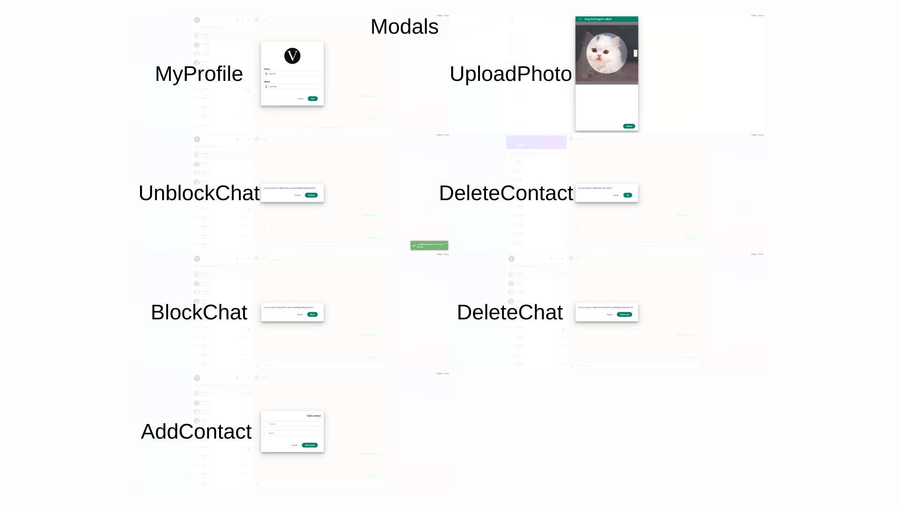

**Validasyon Örneği (Add Contact):** Kişi ekleme modalı, girilen ismin 2-32 karakter arasında olduğunu ve e-posta formatının geçerliliğini anlık olarak denetler.

| Hatalı E-posta Formatı | Kısa İsim Hatası |
| :---: | :---: |
| 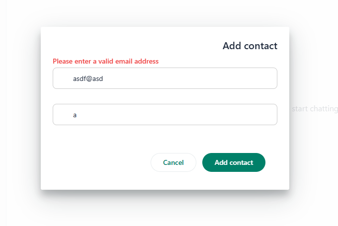 |  |

### 3.2. Ana Sayfa (Home)

Kullanıcının karşılandığı, genel durum özetini ve menüleri içeren ana ekran.

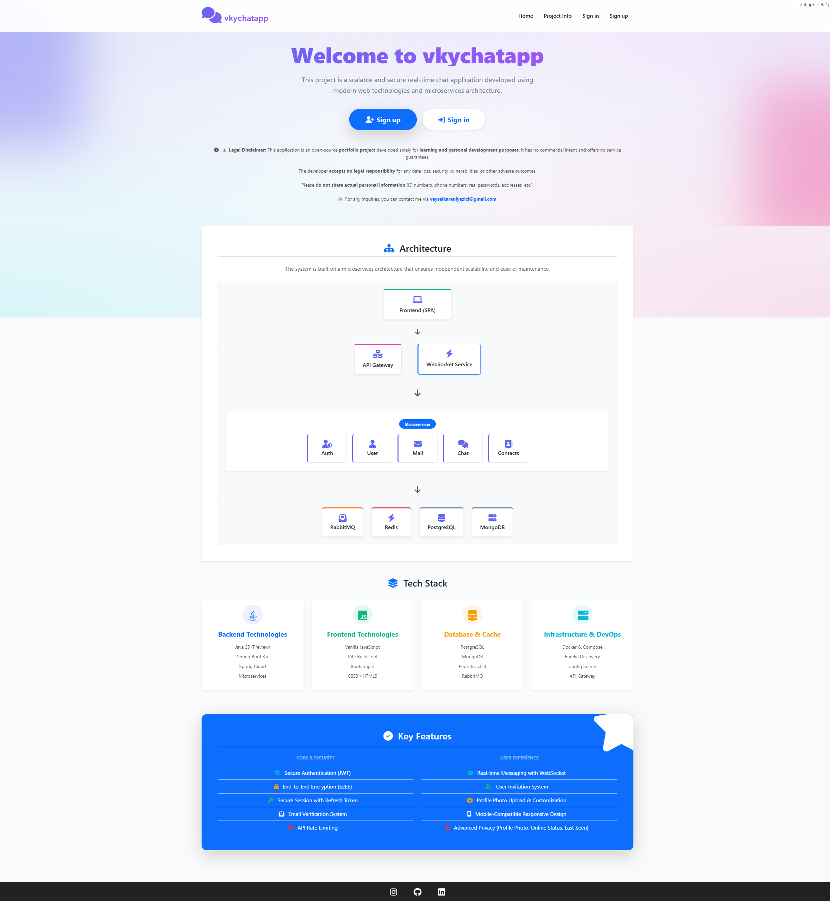

### 3.3. Giriş ve Güvenlik (Authentication)

Kullanıcıların güvenli bir şekilde hesaplarına erişim sağladığı modern giriş ekranı. **Çift Katmanlı Doğrulama (Dual-Layer Validation)** sayesinde hatalı girişler anında engellenir.

- **E-posta Validasyonu:** RFC 5322 standartlarına uygun format kontrolü hem frontend hem backend tarafında yapılır (Max 254 karakter).
- **Güvenlik Politikası:** reCAPTCHA tokenı olmayan veya Google Skoru 0.5'in altında kalan şüpheli giriş istekleri sunucu tarafından reddedilir.

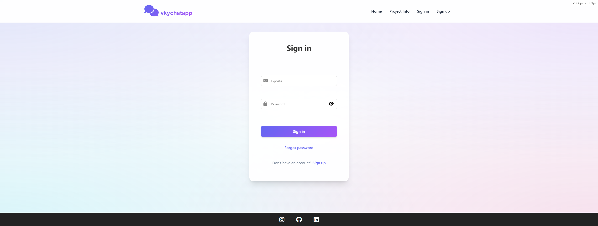

### 3.4. Kayıt Ol (Register)

Yeni kullanıcıların E2EE anahtarlarının oluşturulduğu kayıt formu. Sistem, zayıf parolaları ve geçersiz anahtarları kabul etmez.

**Zorunlu Parola Politikası (Regex):**
- Parola 8-32 karakter uzunluğunda olmalı.
- En az 1 Büyük Harf (A-Z)
- En az 1 Küçük Harf (a-z)
- En az 1 Rakam (0-9)
- En az 1 Özel Karakter (@#$%^&+=.?!-_)

- **Kriptografik Kontrol:** İstemcide üretilen `Public Key` ve `Encrypted Private Key` değerlerinin en az **64 byte** uzunluğunda olduğu sunucu tarafında doğrulanır.
- **Bütünlük:** Salt (16 byte) ve IV (12 byte) değerleri eksiksiz olmalıdır.

| Parola Karmaşıklık Kontrolü | Kayıt Ekranı |
| :---: | :---: |
| 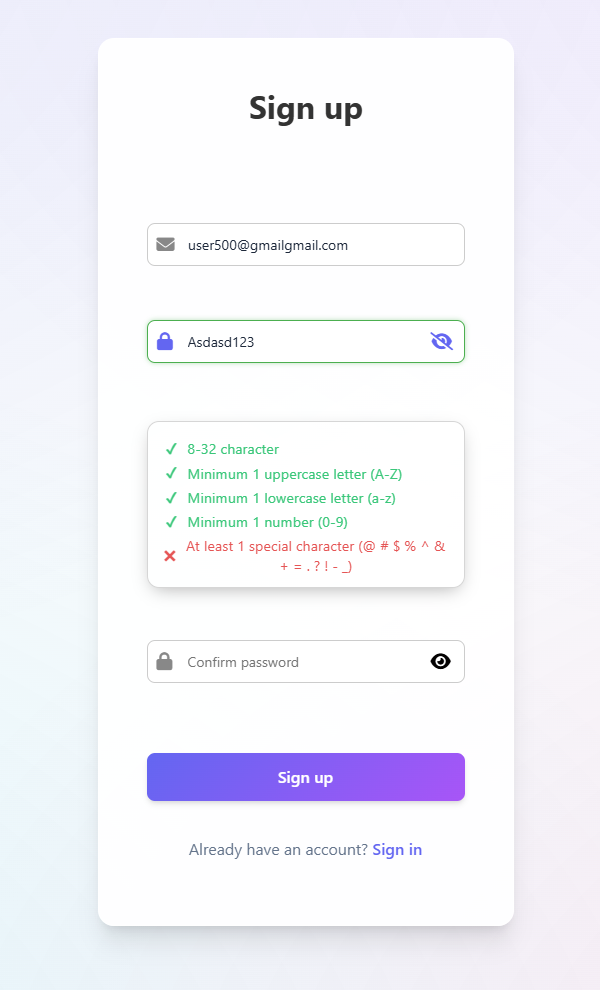 | 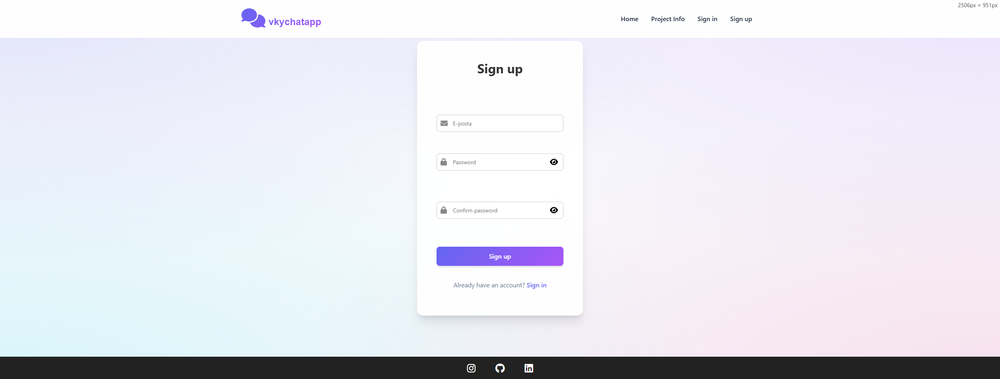 |

### 3.5. Şifre Sıfırlama (Forgot Password)

Unutulan şifrelerin güvenli bir şekilde yenilendiği 3 aşamalı süreç. Bu işlem sırasında eski E2EE anahtarları imha edilir ve yeni bir kimlik oluşturulur.

#### Adım 1: Talep (Request)

Kullanıcı e-posta adresini girer. Sistem, bu adrese 6 haneli tek kullanımlık bir kod (OTP) gönderir.

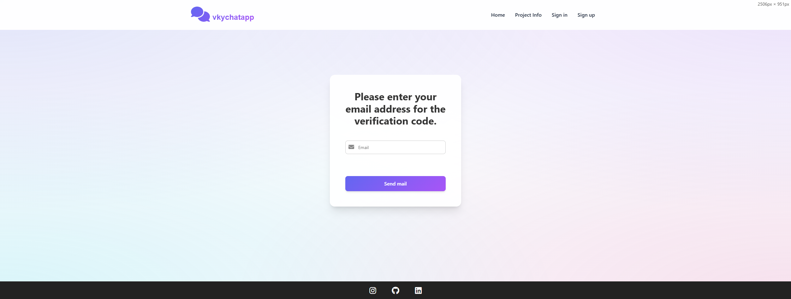

#### Adım 2: Doğrulama (Verification)

E-postaya gelen kod doğrulanır. Bu aşamada sunucu, geçici bir `resetToken` üretir.

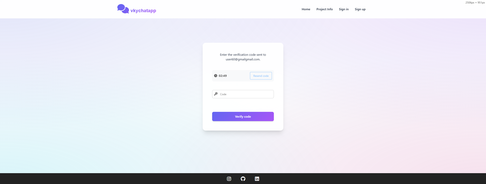

#### Adım 3: Yenileme (Reset & Key Regeneration)

Kullanıcı yeni parolasını belirler. Tarayıcı arka planda:
- Yeni bir **RSA Key Pair** üretir.
- Yeni paroladan türetilen AES anahtarı ile Private Key'i şifreler.
- Eski Public Key'i hükümsüz kılarak yeni anahtarları sunucuya yükler.

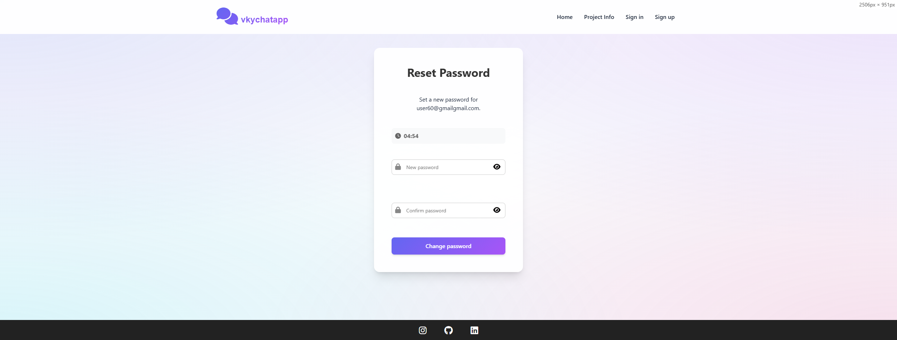

### 3.6. Gizlilik Ayarları (Privacy)

Son görülme, profil fotoğrafı ve okundu bilgisi gibi gizlilik tercihlerinin yönetildiği panel.

| Gizlilik Ayarları Paneli | Çevrimiçi Durum Gizliliği |
| :---: | :---: |
| 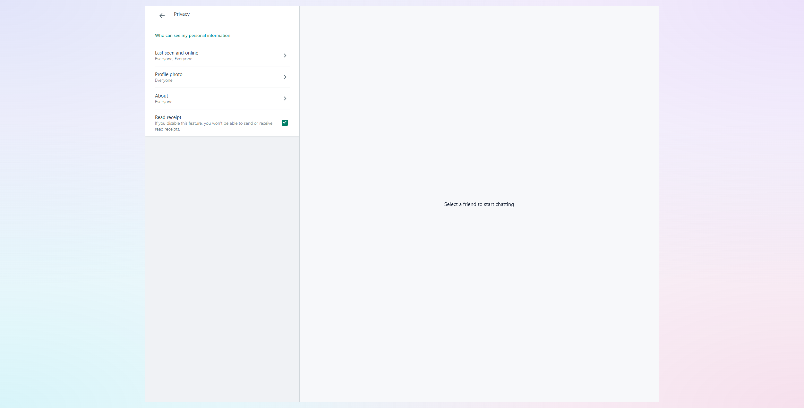 | 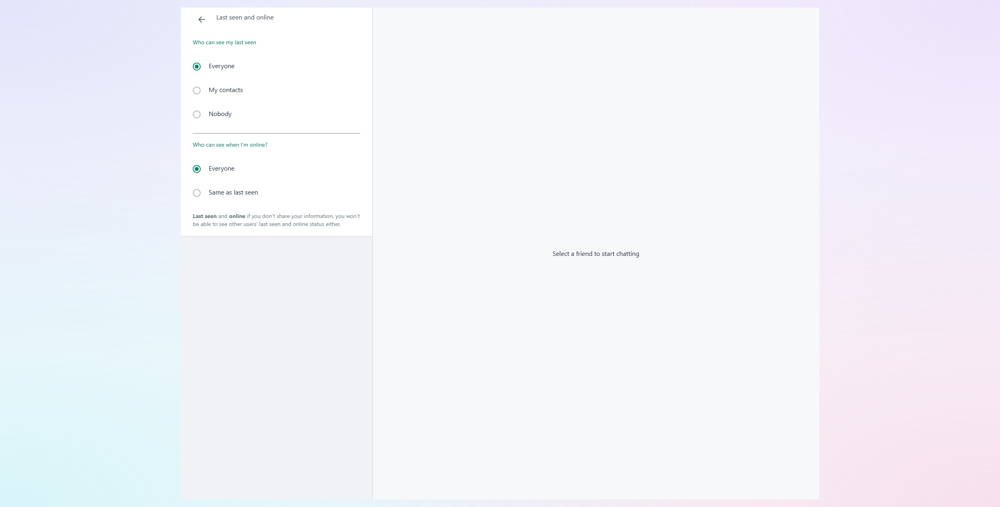 |

### 3.7. Profil ve Hesap Yönetimi

Kullanıcıların profillerini özelleştirebildiği ve hesap güvenliğini yönettiği ekranlar.

| Genel Ayarlar Menüsü | Profil Bilgilerini Düzenleme | Güvenli Şifre Değiştirme |
| :---: | :---: | :---: |
| 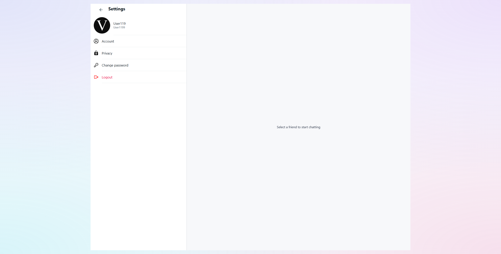 | 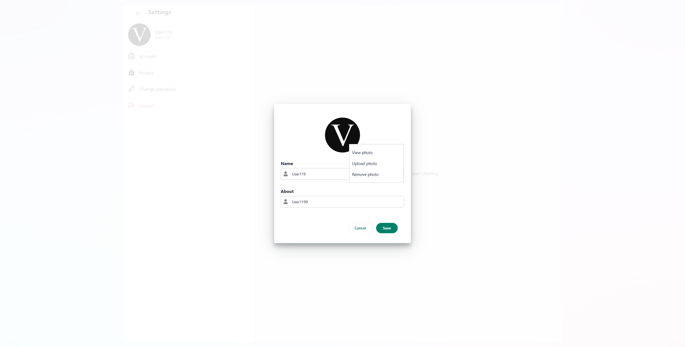 | 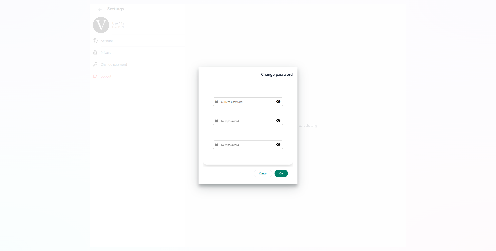 |

### 3.8. Sohbet Arayüzü (Chat Box)

Gerçek zamanlı mesajlaşmanın, emoji desteğinin ve dosya paylaşımının yapıldığı ana sohbet penceresi.

| Ana Sohbet Ekranı | Çevrimiçi (Online) Durum Gösterimi | Anlık "Yazıyor..." İndikatörü |
| :---: | :---: | :---: |
| 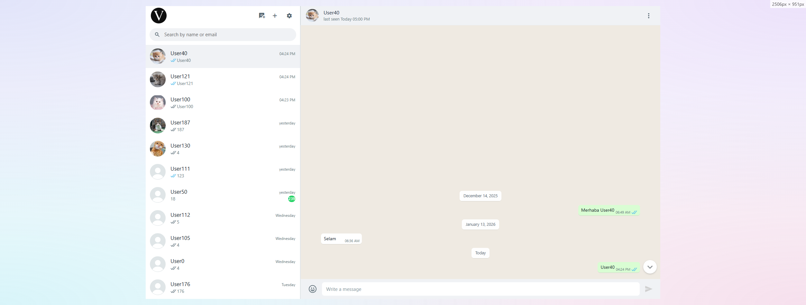 |  |  |

### 3.9. Kişi Bilgileri ve Medya (Contact Info)

Sohbet edilen kişinin detaylı bilgilerinin ve paylaşılan medyaların görüntülendiği alan.

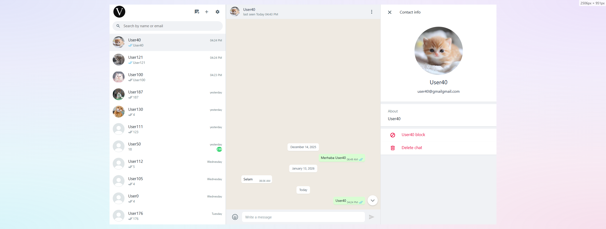

### 3.10. Kişiler (Contacts)

Kayıtlı kullanıcıların listelendiği, arama ve filtreleme yapılabilen rehber ekranı.

| Kişi Listesi | Yeni Kişi Ekleme Modalı | Kullanıcı Arama ve Filtreleme | Kullanıcı Engelleme Seçeneği |
| :---: | :---: | :---: | :---: |
|  | 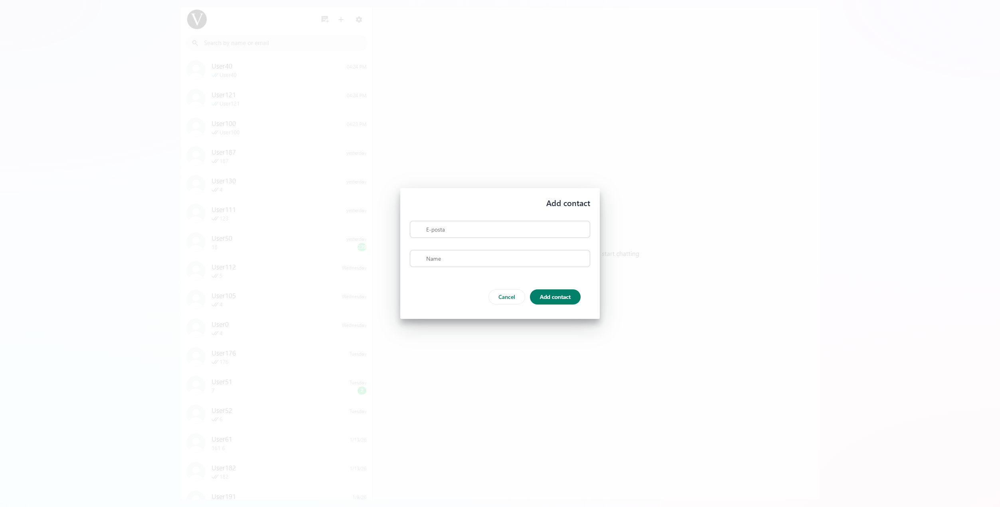 |  | 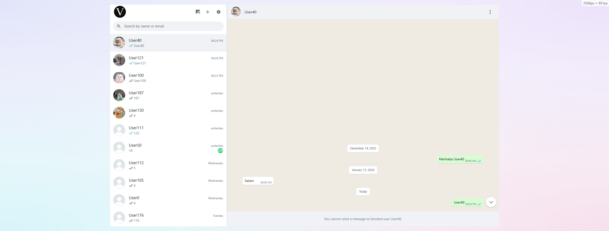 |

## 4. Mobil Uyumluluk (Mobile Responsiveness)

Uygulama, masaüstü deneyiminin yanı sıra mobil cihazlarda da kusursuz çalışacak şekilde tasarlanmıştır. Responsive (Duyarlı) tasarım sayesinde, ekran boyutuna göre arayüz otomatik olarak şekillenir ve dokunmatik kontrollerle tam uyumlu çalışır.

| Mobil Kişi Listesi | Mobil Sohbet Görünümü | Mobil Mesajlaşma Alanı | Mobil Kişi Detayları | Mobil Ayarlar Menüsü |
| :---: | :---: | :---: | :---: | :---: |
| 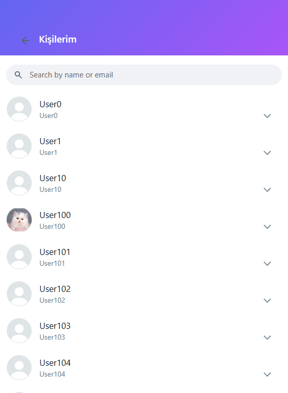 |  | 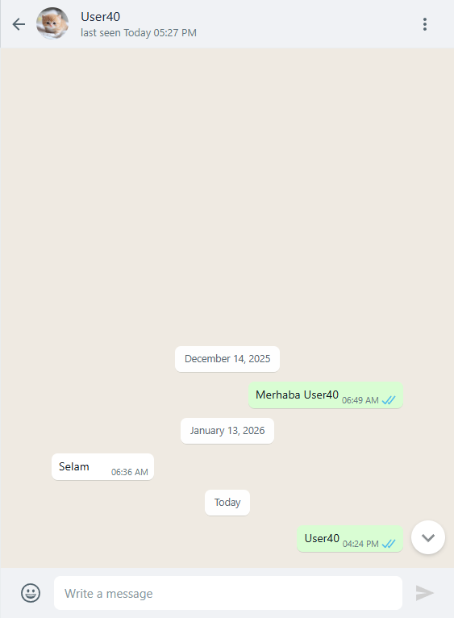 | 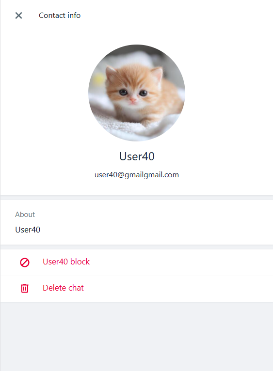 | 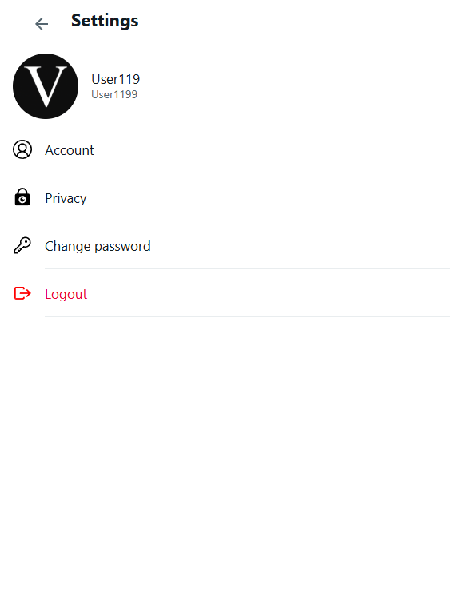 |

## 5. Sonuç

Bu çalışma, sadece işlevsel bir sohbet uygulaması değil, aynı zamanda **güvenlik, performans ve ölçeklenebilirlik** konularında derinlemesine bir mühendislik çalışmasıdır.

- **Güvenlik:** Uçtan uca şifreleme (E2EE) ve Token Blacklist ile kullanıcı verileri koruma altındadır.
- **Performans:** Redis Rate Limiting ve Virtual Scroll gibi optimizasyonlarla yüksek trafik altında bile akıcı deneyim sağlanır.
- **Mimari:** Mikroservis yapısı ve Polyglot Persistence yaklaşımı, projenin esnek ve geliştirilebilir olmasını garanti eder.

## 6. Lokalde Frontend'i Çalıştırma Rehberi

Projeyi kendi bilgisayarınızda arayüz tarafını çalıştırmak için yapmanız gerekenler oldukça basittir.

### 6.1. Repoyu Klonlama ve Gereksinimler

Frontend reposunu bilgisayarınıza indirin:

```bash
git clone https://github.com/veyselkyazici/chat-app-f.git
cd chat-app-f
```

**Gereksinimler:** Proje bağımlılıklarını kurabilmek için sisteminizde **Node.js (LTS sürümü)** ve **npm** paket yöneticisi kurulu olmalıdır.

### 6.2. Bağımlılıkların Yüklenmesi

Vite ve diğer gerekli istemci bağımlılıklarını kurmak için terminalinizde proje ana dizinindeyken aşağıdaki komutu çalıştırın:

```bash
npm install
```

### 6.3. Ortam Değişkeni (Environment Variable) Ayarları

Frontend'in, daha önceden lokalinizde ayağa kaldırdığınız Backend API Gateway ile haberleşebilmesi için adresleri tanımlamamız gerekir. Proje kök dizininde (`index.html` ile aynı seviyede) **`.env`** adında gizli bir dosya oluşturun ve içine şunları yazın:

```env
# WebSocket Gateway Adresi
VITE_BASE_URL_WEBSOCKET=ws://localhost:8080/ws

# API Gateway HTTP Adresleri
VITE_BASE_URL_USER=http://localhost:8080/api/user
VITE_BASE_URL=http://localhost:8080/api/v1
VITE_USER_SERVICE_URL=/user
VITE_AUTH_SERVICE_URL=/auth
VITE_CHAT_SERVICE_URL=/chat
VITE_CONTACTS_SERVICE_URL=/contacts
VITE_INVITATION_SERVICE_URL=/invitation
VITE_MAIL_SERVICE_URL=/mail
```

*Not: Eğer backend adresleriniz faklıysa veya gateway kullanmıyorsanız bu adresleri kendi localhost/port ayarlarınıza göre güncelleyin.*

### 6.4. Geliştirme Sunucusunu (Dev Server) Başlatma

Vite'ın sunduğu aşırı hızlı Hot Module Replacement (HMR) destekli geliştirme sunucusunu başlatmak için şu komutu girin:

```bash
npm run dev
```

Komut çalıştığında terminalde uygulamanın hangi adreste (Genellikle `http://localhost:5173`) ayağa kalktığını göreceksiniz. O linke tıklayarak veya tarayıcınızda açarak projeye erişebilirsiniz.

### 6.5. Uygulamayı Derleme (Production Build)

Geliştirme süreci bittiğinde, projeyi canlı sunucuya atmaya hazırlamak ve tamamen optimize edilmiş saf, minifiye edilmiş JS/CSS dosyalarına dönüştürmek için:

```bash
npm run build
```